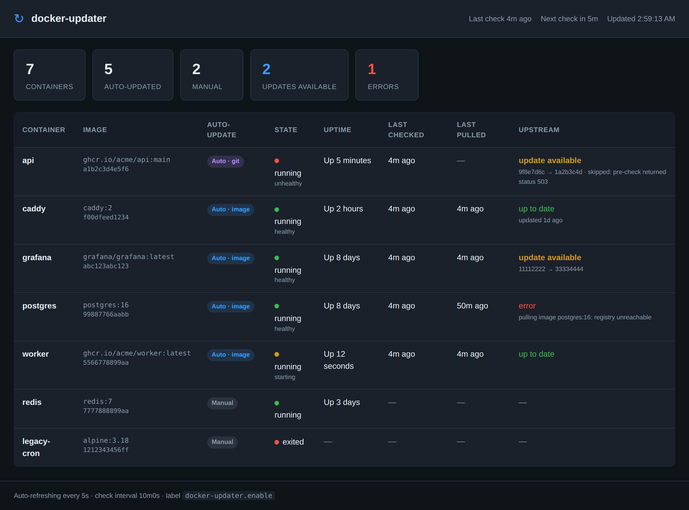

# docker-updater

Automatic Docker container updater service. Monitors running containers and updates them when newer versions are available.

## Features

- **Image-based updates**: Detects new image digests from container registries (watchtower-style)
- **Git-based updates**: Monitors git remote refs via smart HTTP protocol to detect new commits
- **Build-based updates**: For locally-built (compose `build:`) services that are never pushed to a registry, watches the service's **base image** and rebuilds + recreates via `docker compose` when the derived image no longer extends the base's current release — instead of fruitlessly pulling a local-only tag every cycle
- **Standard update-check endpoints**: containers expose `/.well-known/docker-updater/health` and `/.well-known/docker-updater/pre-update`; docker-updater discovers them with no configuration and warns about containers that serve neither
- **Pre-update checks**: HTTP or exec-based checks to verify containers are ready before updating
- **Post-update health checks**: HTTP or exec-based checks to verify new containers are healthy without requiring `curl` or any binary inside the image
- **Automatic rollback**: if the replacement container fails its post-update health check, the previous image is restored under the same name -- a failed update never leaves the service down
- **Self-update**: docker-updater can update its own container. Because it can't stop+recreate itself inline (that kills the process mid-swap), it hands the swap to a short-lived detached helper -- so a published fix actually reaches the running updater
- **Web dashboard**: Built-in status page showing every container (monitored or not), uptime, restart count, last pull, and whether a newer image is upstream
- **Webhook notifications**: Supports generic, Discord, and Slack webhooks
- **GitHub webhook trigger**: An authenticated inbound endpoint that lets GitHub kick off a check the moment a ghcr image is pushed, instead of waiting for the next interval
- **Dry-run mode**: Monitor for updates without applying them
- **Scratch image**: no libc, no shell — just static binaries: the updater itself plus the Docker CLI with the compose/buildx plugins that build mode shells out to

## Usage

```bash
docker run -d \
  --network host \
  -v /var/run/docker.sock:/var/run/docker.sock \
  ghcr.io/wow-look-at-my/docker-updater
```

Host networking is recommended so docker-updater can reach containers' pre-check endpoints directly via their bridge IPs, without joining every container's network.

## Configuration

All configuration is via environment variables:

| Variable | Default | Description |
|----------|---------|-------------|
| `DOCKER_UPDATER_INTERVAL` | `5m` | Check interval (Go duration) |
| `DOCKER_UPDATER_LABEL` | `docker-updater.enable` | Container opt-in label |
| `DOCKER_UPDATER_WEBHOOK_URL` | | Outbound notification webhook endpoint URL |
| `DOCKER_UPDATER_WEBHOOK_TYPE` | `generic` | `generic`, `discord`, or `slack` |
| `DOCKER_UPDATER_DRY_RUN` | `false` | Monitor only, don't update |
| `DOCKER_UPDATER_CONFIG` | | Path to Docker `config.json` for private registry auth |
| `DOCKER_UPDATER_DASHBOARD_ADDR` | `:8080` | Listen address for the web dashboard; set empty to disable |
| `DOCKER_UPDATER_GITHUB_WEBHOOK_ADDR` | | Listen address for the inbound GitHub webhook (e.g. `:9000`); empty disables it |
| `DOCKER_UPDATER_GITHUB_WEBHOOK_SECRET` | | Shared secret for verifying GitHub webhook signatures; **required** when the webhook is enabled |
| `DOCKER_UPDATER_GITHUB_WEBHOOK_PACKAGES` | | Comma-separated allowlist of package names (or `namespace/name`) that may trigger a check; empty means any package. Most useful with an org-level webhook |
| `DOCKER_UPDATER_CONTAINER_ID` | *(auto-detected)* | docker-updater's own container ID, used to route [self-updates](#self-update-updating-docker-updater-itself) through the detached helper. Auto-detected from `/proc/self/mountinfo`; set this only if detection fails |

## Dashboard

docker-updater serves a read-only web dashboard (default `:8080`) that lists
**every** container on the host -- both the ones it auto-updates and the ones it
doesn't -- so you can see your fleet at a glance. The dashboard's static assets
are served with strong SHA-256 `ETag`s and `Cache-Control: no-cache`, so
browsers and any cache in front revalidate on every load (a cheap 304 while
unchanged) and a deploy can never leave a stale `dashboard.js` running against
a newer `index.html`:



- **Auto-update status**: whether a container is monitored, and in `image`, `git`, or `build` mode
- **State & uptime**: running/stopped, healthcheck status, and how long it has been up
- **Restarts**: Docker's restart count -- how many times the daemon's restart policy has restarted the container since it was last (re)created. Because docker-updater creates a fresh container on every pull, this reads as "restarts since the last pull" for monitored containers, and a non-zero value flags a crash-looping container
- **Last pulled**: when docker-updater last actually downloaded a newer image. An up-to-date check that downloads nothing does **not** advance it, so the column tracks genuine image changes instead of resetting every cycle
- **No "last checked" column**: every monitored container is polled in the same cycle, so it read identically on every row. The top bar's **Last check** / **Next check** carries it once; the per-container timestamp stays in the JSON API as `last_checked`
- **Upstream**: whether a newer image digest (or git commit) is available -- and, when it is, why it has not been applied yet -- or the last error
- **Warnings**: amber lines under a container's name when it serves no standard [update-check endpoints](#update-checks-the-well-knowndocker-updater-endpoints), or overrides them with the older labels. Configuration notes, not failures -- updates still run

Containers are grouped into four collapsible sections -- **Managed · online**,
**Managed · offline**, **Unmanaged · online**, and **Unmanaged · offline** --
where *managed* means the container carries the enable label and *offline*
means it is exited, dead, or created but never started. Empty groups are
hidden, and the unmanaged-offline group starts collapsed. A search box in the
top bar filters every group by container name or image (press `/` to focus it,
`Escape` to clear). Rows whose container was **actually updated** in the last
10 minutes get a green highlight that fades as the update ages, so a fresh
deploy is visible at a glance.

### Summary counters

The cards across the top total your containers, auto-updated, manual, and errors,
plus **updates pending**. That last one is the one people ask about, so to be
explicit:

- An update only counts as *pending* when it was **detected but deliberately not
  applied**: dry-run mode is on, a [pre-check](#pre-update-checks) held it back,
  or applying it errored. Containers that auto-update cleanly never appear here --
  the newer image is pulled and the container recreated within the *same* check
  cycle, so there is nothing left "available". A non-zero count therefore means
  those updates are waiting on one of those three gates, **not** that the updater
  is sitting idle on work it could do.
- The affected rows are tinted and tagged `update available` with the reason
  (`dry-run`, `skipped: <reason>`, or `error: <message>`) in the Upstream column.
  Click the **updates pending** card to jump straight to them; if the first one
  sits in a collapsed group, that group is expanded automatically.

The **errors** card carries a **copy** button that puts every current error on
the clipboard as plain text -- one block per container with its name, image,
state, the refs it was trying to move between, and the full untruncated error --
so a broken update is one click away from a bug report. It is disabled when
there are no errors, and falls back to a hidden-textarea copy on plain `http`,
where the browser clipboard API is unavailable.

The page auto-refreshes every few seconds. The footer shows the **build hash of
the running docker-updater** (short SHA; hover for the full one — the same
commit the image's `org.opencontainers.image.version` label carries), so you can
tell at a glance which build is answering. The same hash is printed at startup
(`docker-updater <sha> starting`) and returned in the `version` field of the
JSON API. The same data is available as JSON at `/api/containers`, and
`/healthz` returns `200 ok` for external liveness probes.

With `--network host` (recommended), the dashboard is reachable on the host's
port directly, e.g. `http://<host>:8080`. Without host networking, publish the
port (`-p 8080:8080`). Set `DOCKER_UPDATER_DASHBOARD_ADDR` to a different address
(e.g. `:9000`) to move it, or to an empty string to disable it entirely.

Note that "last pulled" and "last checked" only apply to monitored containers;
the tool never polls the registry for containers it isn't watching.

### Developing the dashboard

The dashboard's client logic lives in [`dashboard/dashboard.ts`](dashboard/dashboard.ts)
(TypeScript). It is typed against the `/api/containers` JSON contract, so a
renamed or wrong-typed field is a compile error rather than a runtime
`undefined`. The browser loads the compiled `dashboard/dashboard.js`, which is
checked in and embedded into the Go binary via `go:embed` -- so a plain
`go build` needs no Node toolchain.

After editing `dashboard.ts`, recompile and commit the generated `dashboard.js`:

```bash
cd dashboard
npm ci          # first time only
npm run build   # compiles dashboard.ts -> dashboard.js
```

Run `npm run typecheck` to type-check without emitting. CI type-checks the source
and fails if the committed `dashboard.js` is out of date with `dashboard.ts`, so
do not hand-edit the generated file.

## GitHub Webhook Trigger

Normally docker-updater polls the registry every `DOCKER_UPDATER_INTERVAL`. With
a short interval that means a lot of needless polling; with a long interval a
freshly pushed image can sit unnoticed for a while. The inbound GitHub webhook
closes that gap: when GitHub Packages publishes or updates a package (a ghcr
image), it POSTs to docker-updater, which runs a check **immediately** instead
of waiting out the rest of the interval.

This endpoint is meant to be reachable from the public internet (GitHub has to
reach it), so it is locked down:

- **Authenticated.** Every request must carry a valid GitHub `X-Hub-Signature-256`
  HMAC-SHA256 signature of the raw body, computed with your shared secret and
  checked in constant time. Requests without a valid signature get `401` and are
  ignored.
- **Fail closed.** The listener refuses to start without
  `DOCKER_UPDATER_GITHUB_WEBHOOK_SECRET`; docker-updater will exit with a config
  error rather than expose an unauthenticated trigger.
- **Isolated.** It runs on its own listen address, separate from the dashboard,
  so you can expose this port publicly while keeping the dashboard internal.
- **Hardened.** POST-only, the body is size-capped (1 MiB), and unrelated events
  are acknowledged but ignored. The `ping` GitHub sends on creation is answered
  so the delivery shows healthy.

A burst of deliveries (for example the several events a multi-arch push emits)
coalesces into at most one pending check, and a webhook-triggered check realigns
the interval timer so the next scheduled poll is a full interval later.

### Enabling it

Set both variables and publish the port:

```yaml
environment:
  DOCKER_UPDATER_GITHUB_WEBHOOK_ADDR: ":9000"
  DOCKER_UPDATER_GITHUB_WEBHOOK_SECRET: "use-a-long-random-string"
```

With `--network host` the endpoint is reachable on the host's port directly
(e.g. `http://<host>:9000`); otherwise publish it (`-p 9000:9000`). Because the
request carries a secret, terminate TLS in front of it (a reverse proxy such as
nginx, Traefik, or Caddy) so deliveries travel over HTTPS. The webhook accepts
any request path, so route whatever public path you like to it.

### Configuring the webhook on GitHub

In the repository (or organization) **Settings > Webhooks > Add webhook**:

- **Payload URL**: your public URL, e.g. `https://updater.example.com/`
- **Content type**: `application/json`
- **Secret**: the same value as `DOCKER_UPDATER_GITHUB_WEBHOOK_SECRET`
- **Which events**: choose "Let me select individual events" and tick
  **Packages** (only)

GitHub sends a `ping` on save; a `200 pong` confirms the secret and URL are
correct. From then on, each package publish/update triggers an immediate check.

A valid delivery triggers a full check of all monitored containers (the same
work a normal interval tick does), so you don't need to map the package to a
specific container -- whichever containers have a newer image get updated.

### Repository vs organization webhooks

The webhook can be added on a single repository or on the whole organization
(**Org Settings > Webhooks**). The authentication is identical either way -- the
same secret and `X-Hub-Signature-256` signature -- so no extra configuration is
needed for an org-level hook.

The one behavioral difference: an **organization** webhook fires for *every*
package event in the org, not just the image you have in mind. Each delivery
runs a full check, which is harmless (checks are idempotent and bursts coalesce
into at most one pending check) but can be more frequent than necessary if the
org publishes many unrelated packages.

To scope an org-level hook to just the images you care about, set
`DOCKER_UPDATER_GITHUB_WEBHOOK_PACKAGES` to a comma-separated allowlist of
package names. Only matching deliveries trigger a check; the rest are
acknowledged and ignored. Each entry matches either the bare package name or its
`namespace/name` form (case-insensitive):

```yaml
environment:
  # ghcr.io/wow-look-at-my/buildhost and .../docker-updater
  DOCKER_UPDATER_GITHUB_WEBHOOK_PACKAGES: "buildhost,wow-look-at-my/docker-updater"
```

Leave it empty (the default) to react to any package -- the right choice for a
single-repository webhook.

## Update Checks: the `/.well-known/docker-updater/` endpoints

The standard way a container tells docker-updater whether it may be updated and
whether it came back healthy. Serve two `GET` endpoints on your HTTP port and
docker-updater finds them by itself -- **no labels**:

| Path | 2xx means |
|---|---|
| `/.well-known/docker-updater/health` | the container is up after an update (polled until the timeout, else the update is rolled back) |
| `/.well-known/docker-updater/pre-update` | it is OK to update right now (non-2xx holds the update to the next cycle). Optional -- a 404 here never blocks |

docker-updater derives the address from the container's own network settings and
its single exposed TCP port; set `docker-updater.well-known.port` when several
are exposed. Containers that serve no HTTP at all opt out with
`docker-updater.well-known: "false"`.

Containers that serve neither endpoint keep working -- liveness falls back to
Docker's `HEALTHCHECK` -- but the dashboard shows an amber warning naming what to
implement. The older `pre-check.*` / `health-check.*` labels still work and take
precedence; a container using them is flagged **nonstandard** so a fleet can be
migrated deliberately.

Full contract, discovery rules, warning texts, and copy-paste handlers:
[docs/well-known-endpoints.md](docs/well-known-endpoints.md).

## Container Labels

Add these labels to containers you want to monitor:

```yaml
labels:
  docker-updater.enable: "true"
  # Optional: update mode (default: image)
  docker-updater.mode: "image"  # or "git" or "build"
  # Git mode only:
  docker-updater.git-repo: "https://github.com/user/repo"
  docker-updater.git-ref: "refs/heads/main"
  # Build mode only (locally-built compose `build:` services):
  docker-updater.base-image: "ghcr.io/anomalyco/opencode:latest"  # base image to watch
  # Post-update health check (HTTP or exec; falls back to Docker HEALTHCHECK):
  docker-updater.health-check.url: ":8080/health"
  docker-updater.health-check.command: "curl -sf http://localhost:8080/health"
  docker-updater.health-check.timeout: "60s"
  # Pre-update readiness check:
  docker-updater.pre-check.url: ":8080/ready-to-update"
  docker-updater.pre-check.command: "/check-ready.sh"
  docker-updater.pre-check.timeout: "30s"
  # Standard update-check endpoints (see above): pick the port, or opt out
  docker-updater.well-known.port: "8080"
  docker-updater.well-known: "false"
  # Zero-downtime rolling update:
  docker-updater.rolling: "true"
```

### Post-Update Health Checks

After starting the replacement container, docker-updater verifies it is healthy before completing the update. In order of precedence:

0. **Standard endpoint** (`/.well-known/docker-updater/health`): used automatically when the container serves it and no health-check label is set -- see [Update Checks](#update-checks-the-well-knowndocker-updater-endpoints)
1. **HTTP health check** (`docker-updater.health-check.url`): docker-updater polls the URL via HTTP GET from its own process -- no `curl` or other binary inside the container is required. This is the fix for images that ship without a shell or HTTP client (e.g. when `ollama` dropped `curl`, its in-container `HEALTHCHECK` could no longer run).
2. **Exec health check** (`docker-updater.health-check.command`): docker-updater runs a command inside the container via `docker exec` (requires a shell). Exit code 0 means healthy.
3. **Docker HEALTHCHECK fallback**: if neither label is set, docker-updater waits for Docker's built-in `HEALTHCHECK` to report `healthy`. The wait deadline is derived from the container's own `HEALTHCHECK` config (`start-period + retries × interval + probe timeout`, with a 30s floor and a 5-minute fallback when no config is present), so slow-starting containers only need the right `HEALTHCHECK` parameters.
4. **No healthcheck at all**: if the image defines no `HEALTHCHECK` either, the new container only has to stay running (with no restarts) through a 15-second grace period. This is a weaker gate -- prefer one of the three above -- but it keeps healthcheck-less containers updatable instead of failing every update.

For the HTTP and exec checks, docker-updater polls every 2 seconds until the check passes or `docker-updater.health-check.timeout` (default 60s) elapses.

If the health check fails, the update is **rolled back**:

- **Standard (recreate) mode**: the failed replacement is stopped and removed, the previous image is re-tagged to the container's original reference, and a container running the previous image is started under the original name. A failed update therefore never leaves the service down; the update is retried on the next check cycle.
- **Rolling mode**: the old container was never stopped; the failed `-next` container is stopped and removed.

Failures and rollbacks are reported via webhook notifications and surface as errors on the dashboard.

A compose recreate that fails *before* compose replaces anything -- an unreadable
compose file, an invalid config -- is reported as the plain cause, with no
rollback attempted and no `ROLLBACK FAILED, <service> may be down`: the original
container is confirmed still running on its original image, so there is nothing
to restore and re-running the same failing command would only repeat the error.
Rollback still runs whenever that cannot be confirmed.

```yaml
labels:
  docker-updater.enable: "true"
  # HTTP check from docker-updater's own process (no curl needed in the image):
  docker-updater.health-check.url: ":8080/health"
  docker-updater.health-check.timeout: "60s"  # optional, default 60s
```

```yaml
labels:
  docker-updater.enable: "true"
  # Exec check inside the container:
  docker-updater.health-check.command: "curl -sf http://localhost:8080/health"
  docker-updater.health-check.timeout: "60s"  # optional, default 60s
```

URLs starting with `:` (port prefix) are resolved using the container's bridge IP, the same way pre-check URLs are (see [Pre-Update Checks](#pre-update-checks)). If both `health-check.url` and `health-check.command` are set, the HTTP check takes precedence.

### Image Mode (default)

Polls the container registry for new image digests. When a newer digest is found, the container is recreated with the updated image.

The registry reference to poll is taken from the reference the container was created with (its `Config.Image`, e.g. `ghcr.io/you/app:latest`), falling back to the running image's `RepoDigests` to recover the repository. This is deliberately independent of whether the running image still carries a repo tag: a long-running image can lose its tags (so `docker ps` shows a bare `sha256:...` image ID), and the updater keeps polling the correct tag regardless. If no registry repository can be resolved for a container (e.g. a locally-built image that was never pulled or pushed), that container is logged and skipped rather than stalling the loop.

### Git Mode

Checks a git remote for new commits on the tracked ref using the smart HTTP protocol (no git binary required). When a new commit is detected, the container is recreated with a fresh image pull.

### Build Mode (locally-built images)

`docker-updater.mode: "build"` is for a service whose image is **built locally** by Docker Compose (`build:`) and given a local tag that was never pushed to a registry, e.g. `image: opencode:local`. Such an image has no registry origin (no `RepoDigests`), so the default image mode's `docker pull opencode:local` fails every cycle with `pull access denied ... repository does not exist`. Build mode fixes this:

- It **never** pulls the local derived tag. Instead it watches the service's **base image** (the `FROM` of its build).
- Each cycle it pulls **only** the base image and checks, from the images themselves, whether the derived image still extends it (see *Staleness detection* below). Still current → no-op.
- When the derived image is stale (the base advanced), it rebuilds and recreates the service:

  ```bash
  docker compose -f <config_files> --project-directory <working_dir> -p <project> build --pull <service>
  docker compose -f <config_files> --project-directory <working_dir> -p <project> up -d <service>
  ```

  The container is recreated **only if the rebuilt image ID actually changed** — a cache-hit rebuild that produces the identical image is a no-op (no churn), mirroring image mode.

**Identifying the service.** docker-updater reads the service's compose identity from the standard compose labels Docker stamps on every compose-managed container (`com.docker.compose.project`, `.service`, `.project.config_files`, `.project.working_dir`), so no extra configuration beyond `mode: build` is usually needed. The project name is always passed as `-p`: compose otherwise derives it from the working directory, which is wrong for any stack deployed with an explicit project name (Komodo, Portainer) or a compose file with a top-level `name:` — compose would resolve an empty project, try to *create* the service, and fail with `Conflict. The container name "/x" is already in use`.

**Determining the base image** (in preference order):

1. The explicit `docker-updater.base-image` label (e.g. `ghcr.io/anomalyco/opencode:latest`). **Recommended** — unambiguous and works with any build setup.
2. Otherwise, the `FROM` of the service's Dockerfile (looked up under the compose working directory). Multi-stage Dockerfiles are handled: the base of the **final** stage is watched, resolving `FROM <stage-name>` references back to the stage's own registry base. `FROM scratch`, a build-arg base (`FROM ${BASE}`), or an unreadable/unparseable Dockerfile mean no base can be resolved.

If neither resolves, the container is **skipped** with a one-line log (it never error-loops).

**Staleness detection.** Whether the derived image needs a rebuild is computed from the images themselves, fresh on every cycle: an image built `FROM` a base starts with exactly the base's filesystem layers, so after pulling the base, docker-updater checks that the base's layers are a **prefix** of the layers of the image the service's container actually runs. If they are, the derived image genuinely extends the current base — up to date. If not, the base has advanced and the service is rebuilt. Because this compares ground truth rather than remembered state, it survives updater restarts and container recreations, and it catches staleness that predates the updater itself: a container built from a months-old base is detected and rebuilt on the very first check cycle.

Some builds can never pass the layer check — e.g. a multi-stage Dockerfile whose final stage is `FROM scratch` (or an unrelated image) and only `COPY --from`s artifacts out of the base stage, so the final image doesn't start with the base's layers. docker-updater proves this once rather than looping: after a completed rebuild whose image *still* doesn't extend the base, the service is logged (`falling back to base-digest change tracking`) and switched to the fallback signal — the base digest recorded at the last rebuild, compared each cycle. For such services an updater restart re-adopts the current digest as the baseline (the pre-fix behavior for everything); all other services keep the restart-proof layer check.

Cross-cutting features apply to build mode the same as other modes: pre-update checks (`docker-updater.pre-check.*`) gate the rebuild, post-update health checks (`docker-updater.health-check.*`) verify the recreated container and report failures, and `DOCKER_UPDATER_DRY_RUN` logs the rebuild + recreate it *would* perform while mutating nothing (the update stays pending until really applied). The base-image transition (`<old> -> <new>`) is reported on the dashboard and via webhooks like any other update.

#### Build-mode example

```yaml
services:
  opencode:
    build: .                       # Dockerfile FROM ghcr.io/anomalyco/opencode:latest
    image: opencode:local          # local-only tag, never pushed
    labels:
      docker-updater.enable: "true"
      docker-updater.mode: "build"
      docker-updater.base-image: "ghcr.io/anomalyco/opencode:latest"
```

When `ghcr.io/anomalyco/opencode:latest` publishes a new release, the local image no longer extends the pulled base, so docker-updater runs `docker compose build --pull opencode` and `docker compose up -d opencode`, recreating the service on the rebuilt image. Without build mode, this same service would log a `pull access denied` error every cycle and never update.

> **Requirement:** build mode shells out to the `docker` CLI with the Compose plugin (`docker compose`). The published image ships the statically-linked Docker CLI plus the compose and buildx CLI plugins — and a writable `/tmp`, which compose/buildx hard-require (a `dockerfile_inline` build is materialized into a temp directory, and compose's bake integration writes its metadata file under the temp dir) — so build mode works out of the box. The one thing you must provide is the service's **compose file and build context**, mounted into the docker-updater container at the same paths the compose labels record (`working_dir` / `config_files`). If the CLI is ever absent (a custom-built image), a build-mode rebuild fails and is reported as an error rather than silently doing nothing.

#### Troubleshooting a failed rebuild

A failed `docker compose build` / `up` is reported with the **last lines of the compose output attached to the error**, so the dashboard's Upstream column and webhook notifications name the actual cause — not just `exit status 1`. The complete compose output (progress and errors) always streams into the updater's own log: `docker logs docker-updater`.

The two failure signatures worth knowing:

- **Compose tree not mounted.** Compose runs *inside* the docker-updater container, so it can only see the compose file and build context if they are bind-mounted into it at the **same absolute paths** recorded on the service's containers. Every compose invocation is pre-flighted against the paths in the `config_files` label and fails before the CLI is reached with `compose file /srv/stack/docker-compose.yml is not visible to docker-updater ... (mount it, e.g. -v /srv/stack:/srv/stack:ro)`. Use read-write instead of `:ro` if the build writes into its context. This applies to plain image-mode services too: since a compose-managed container is recreated *through* compose, an unmounted compose tree blocks ordinary image updates, not just rebuilds.
- **No writable temp dir.** `mkdir /tmp/dockerfileNNN: no such file or directory` means the image has no `/tmp` — buildx cannot materialize a `dockerfile_inline` (and compose cannot place its bake metadata file). The published image ships `/tmp` (mode `1777`) and sets `TMPDIR=/tmp`; if you build a custom `FROM scratch` image, ship the same.

> **Locally-built images in image mode are skipped.** Even without migrating to build mode, a container in the default image mode whose image has no `RepoDigests` (locally built, no registry origin) is now **detected and skipped** with a warning — `image <x> is locally built and not in a registry; use docker-updater.mode=build` — instead of pull-erroring every cycle.

### Pre-Update Checks

Before applying an update, docker-updater can verify that the container is ready to be updated. This prevents updates during critical operations like database migrations or active request processing.

The standard way is the `/.well-known/docker-updater/pre-update` endpoint, used automatically with no labels at all -- see [Update Checks](#update-checks-the-well-knowndocker-updater-endpoints). The labels below are the older per-container form; they take precedence where set, and the check type is inferred from which one is set.

#### HTTP Check

Set `docker-updater.pre-check.url` to send an HTTP GET before updating. The container is only updated if the response status is 2xx.

```yaml
labels:
  docker-updater.enable: "true"
  docker-updater.pre-check.url: ":8080/ready-to-update"
  docker-updater.pre-check.timeout: "10s"  # optional, default 30s
```

URLs starting with `:` (port prefix) are resolved using the container's bridge IP at runtime. docker-updater inspects the container, finds its IP, and constructs the full URL (e.g., `http://172.17.0.5:8080/ready-to-update`). This requires docker-updater to run with `--network host`.

Full URLs (e.g., `http://myapp:8080/ready`) are used as-is and require docker-updater to share a network with the target container.

#### Exec Check

Set `docker-updater.pre-check.command` to run a command inside the container via `docker exec`. The container is only updated if the command exits with code 0. The command is run via `sh -c`, so the container must have a shell.

```yaml
labels:
  docker-updater.enable: "true"
  docker-updater.pre-check.command: "/check-ready.sh"
  docker-updater.pre-check.timeout: "15s"  # optional, default 30s
```

If both `url` and `command` are set, the HTTP check takes precedence.

If a pre-check fails, the update is skipped for that cycle and retried on the next interval. Skipped updates are reported in webhook notifications.

### Rolling Updates (Zero-Downtime)

Set `docker-updater.rolling: "true"` to start the new container before stopping the old one. This eliminates downtime when a reverse proxy (e.g., nginx) routes traffic by DNS or health.

```yaml
labels:
  docker-updater.enable: "true"
  docker-updater.rolling: "true"
```

The rolling update flow:
1. New container is created with a temporary name and the same networks, but **without** the service aliases
2. docker-updater waits for the health check to pass (HTTP, exec, or Docker HEALTHCHECK)
3. The service aliases move to the new container, and it starts taking traffic
4. Old container receives SIGTERM and drains existing connections
5. Old container is removed, new container is renamed to the original name

Step 1 is what keeps two image versions from serving at once. Docker's DNS returns every address an alias resolves to and rotates them, so a container that holds the alias is taking live traffic — giving the new one that alias before it is healthy load-balances clients across the old and new image for the entire health wait (tens of seconds with a 30s-interval `HEALTHCHECK`), and they get answers shaped by the build being replaced.

The alias move and the old container's SIGTERM are separated by a few seconds so a proxy that caches DNS answers re-resolves while the old container is still reachable; stopping it any sooner turns the cutover into refused connections.

Requirements:
- A reverse proxy must route traffic via Docker DNS (network alias), not published ports
- The container must not publish host ports (the proxy owns port bindings)
- Without a health-check label or an image `HEALTHCHECK`, the next container is only gated on staying running through the grace period -- define a real check for meaningful zero-downtime guarantees

Pre-checks are skipped for rolling updates -- the old container drains naturally via graceful shutdown.

### Self-update (updating docker-updater itself)

docker-updater can keep itself up to date like any other container -- just give its own service the enable label:

```yaml
services:
  docker-updater:
    image: ghcr.io/wow-look-at-my/docker-updater
    labels:
      docker-updater.enable: "true"
```

This matters: without it, a docker-updater fix you publish never reaches the *running* updater, because an updater can't replace its own container the normal way. Stopping and removing its own container would kill the process before it could create the replacement -- it would simply vanish.

To avoid that, when the container due for an update is docker-updater's own, it does **not** recreate itself inline. Instead it:

1. Detects its own container ID (from `/proc/self/mountinfo`, which works even under `network_mode: host`; override with `DOCKER_UPDATER_CONTAINER_ID` if detection ever fails).
2. Spawns a short-lived **detached helper container** from the freshly-pulled new image, given the same Docker socket mount.
3. Returns. The helper -- a separate container with its own lifecycle -- then stops, removes, and recreates the docker-updater container on the new image, and exits (it is `--rm`'d).

The helper reuses the same recreate path as every other update, so the **rollback and health-gate guarantees apply to the updater too**: if the new image fails to stay running, the helper restores the previous docker-updater image. Startup logs `self-update enabled (own container <id>)` when detection succeeds, or `self-update disabled` if it could not determine its own ID (in which case it never tries to update itself).

## Docker Compose Example

```yaml
services:
  docker-updater:
    image: ghcr.io/wow-look-at-my/docker-updater
    network_mode: host  # dashboard reachable at http://<host>:8080
    volumes:
      - /var/run/docker.sock:/var/run/docker.sock
      - ~/.docker/config.json:/config.json:ro
    labels:
      # Let docker-updater update itself (via a detached helper). Without this,
      # updater fixes you publish never reach the running updater.
      docker-updater.enable: "true"
    environment:
      DOCKER_UPDATER_INTERVAL: "10m"
      DOCKER_UPDATER_WEBHOOK_URL: "https://discord.com/api/webhooks/..."
      DOCKER_UPDATER_WEBHOOK_TYPE: "discord"
      DOCKER_UPDATER_CONFIG: "/config.json"
      DOCKER_UPDATER_DASHBOARD_ADDR: ":8080"
      # Optional: let GitHub trigger a check the instant a ghcr image is pushed.
      DOCKER_UPDATER_GITHUB_WEBHOOK_ADDR: ":9000"
      DOCKER_UPDATER_GITHUB_WEBHOOK_SECRET: "use-a-long-random-string"

  my-app:
    image: myapp:latest
    labels:
      docker-updater.enable: "true"
      # HTTP health check from docker-updater's process -- no curl needed in the image:
      docker-updater.health-check.url: ":8080/health"
      docker-updater.health-check.timeout: "60s"
      docker-updater.pre-check.url: ":8080/ready-to-update"
```
